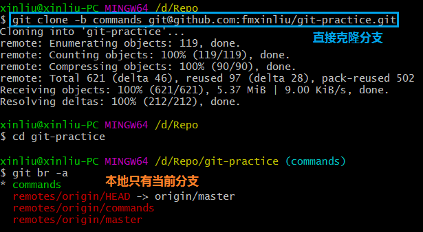
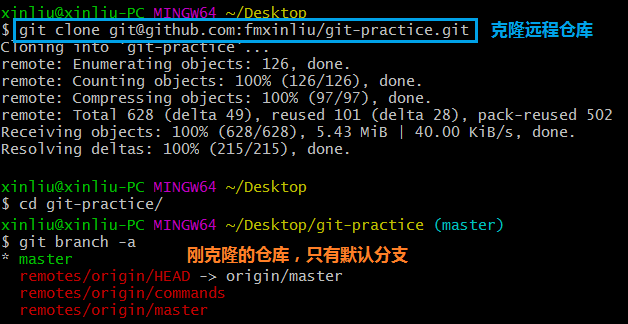
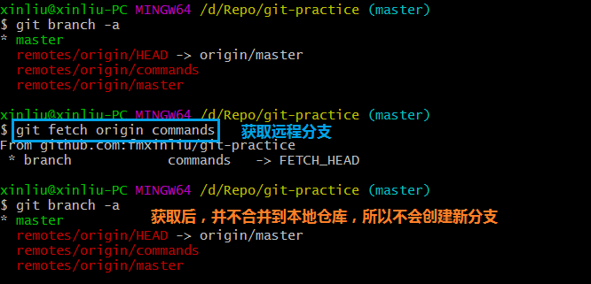
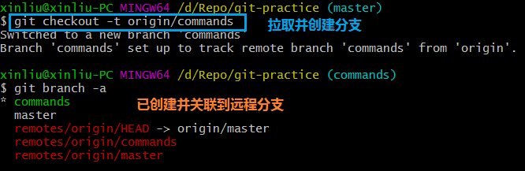

### Git如何拉取指定远程分支

#### 方法一：直接克隆

* 克隆仓库时，执行`git clone -b commands git@github.com:fmxinliu/git-practice.git`。

   

#### 方法二：先拉取再创建

* 执行`git clone git@github.com:fmxinliu/git-practice.git`，克隆仓库到本地。

   

* 执行`git fetch origin commands`，获取远程分支。

    
    
* 执行`git checkout -b commands origin/commands`或`git checkout -t origin/commands`，拉取远程分支。

    
