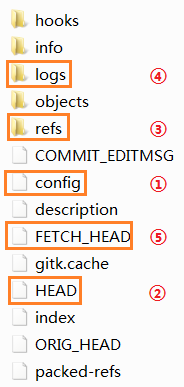
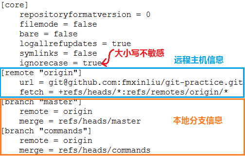
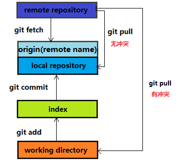

### git 仓库结构

每一个本地库都有一个`.git`的隐藏文件夹，保存着本地库相关的信息。

   

* `config` 文件

   

* `HEAD` 文件

  ```
  ref: refs/heads/commands
  ```

  其指向`.git\refs\heads\commands`文件

  ```
  7f43ed7a22009eac779317027365e0e0e52df362
  ```
  这个文件中保存的是本地库中，`commands`分支最新的提交哈希 *latest commit id*。

* `refs` 文件夹

   

* `logs` 文件夹

`logs`文件夹中保存的是`refs`文件夹中相应文件的变更记录

### 命令对比

本地 *latest commit id* ：`cf30f96ef47631c23e66e4656301d3d1676a36aa`

远程 *latest commit id* ：`275c116902204003cce1cc7d5920bfff3cb4a814`

##### git fetch 详解

```
git fetch origin commands
```

* 执行前
```
.git\refs\heads\commands          ： cf30f96ef47631c23e66e4656301d3d1676a36aa
.git\refs\remotes\origin\commands ： 41feed2060edee9a0d62446ff6e24a9accf4bcfa
.git\FETCH_HEAD                   ： 41feed2060edee9a0d62446ff6e24a9accf4bcfa
```

* 执行后
```
.git\refs\heads\commands          ： cf30f96ef47631c23e66e4656301d3d1676a36aa
.git\refs\remotes\origin\commands ： 275c116902204003cce1cc7d5920bfff3cb4a814
.git\FETCH_HEAD                   ： 275c116902204003cce1cc7d5920bfff3cb4a814	
```

* 可以看到：本地库没有变化，`git fetch`只是将本地库关联的远程库的 *latest commit id*  更新至最新。  

##### git pull 详解

```
git pull origin commands
```

- 执行前
```
.git\refs\heads\commands          ： cf30f96ef47631c23e66e4656301d3d1676a36aa
.git\refs\remotes\origin\commands ： 275c116902204003cce1cc7d5920bfff3cb4a814
.git\FETCH_HEAD                   ： 275c116902204003cce1cc7d5920bfff3cb4a814	
```

- 执行后
```
.git\refs\heads\commands          ： 275c116902204003cce1cc7d5920bfff3cb4a814
.git\refs\remotes\origin\commands ： 275c116902204003cce1cc7d5920bfff3cb4a814
.git\FETCH_HEAD                   ： 275c116902204003cce1cc7d5920bfff3cb4a814
```

* 可以看到：本地库更新至最新，`git pull`不仅将本地库关联的远程库的 *latest commit id*  更新至最新，还会将本地库更新至远程库的最新状态（实际上是**更新+合并** ，可能会造成文件冲突 ）。

##### 对比结果

 

#### 总结
Git中从远程的分支获取最新的版本到本地有 2 个命令： 
1. `git fetch`：相当于是从远程获取最新版本到本地，不会自动合并，可执行如下代码片段合并：

   ```
   git fetch origin commands
   git log -p FETCH_HEAD         <-- 查看修改差异，对于有冲突的文件可先修改，再合并
   git merge origin/commands
   ```

   上述过程，可以用以下更清晰的方式来进行：

   ```
   git fetch origin commands:tmp <-- 从远程获取最新的版本到本地的tmp分支上 
   git diff tmp                  <-- 进行比较
   git merge tmp                 <-- 合并
   ```

2. `git pull`：相当于是从远程获取最新版本到本地，并进行合并
   ```
   git pull origin master
   ```
   从结果上来看，`git pull = git fetch + git merge`，但实现上是不完全相同的。实际使用中，`git fetch`更安全一些，因为在合并前，我们可以查看更新情况，然后再决定是否进行合并；而`git pull`会强行合并，当多人修改了一份文件时，有可能就会引起文件冲突，强行合并的结果就是导致本地库中的文件是混合的，必须小心解决冲突。

