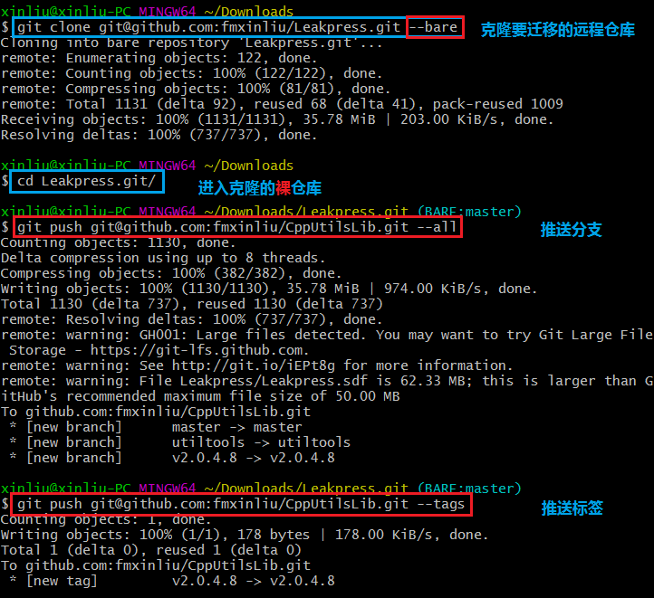

### 远程仓库迁移，保留提交历史

- 镜像远程仓库到本地，执行`git clone git@github.com:fmxinliu/Leakpress.git --bare`

- 进入本地镜像仓库，执行`cd Leakpress.git/`

- 推送所有分支到指定 *URL*，执行`git push git@github.com:fmxinliu/CppUtilsLib.git --all`

- 推送所有标签到指定 *URL*，执行`git push git@github.com:fmxinliu/CppUtilsLib.git --tags`

