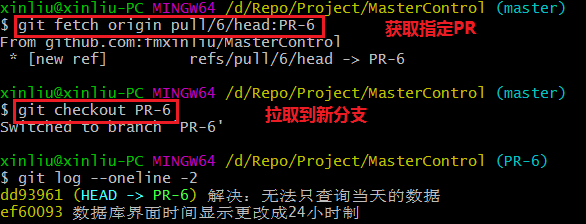

### 拉取、测试、合并 Pull Request

- 镜像远程仓库到本地，执行`git clone git@github.com:fmxinliu/MasterControl.git`

- 进入本地镜像仓库，执行`cd MasterControl/`

- 进入 github 查看想要拉取的 PR 编号ID

- 获取PR，执行`git fetch origin pull/ID/head:BRANCHNAME`

- 拉取PR，执行`git checkout BRANCHNAME`

- 测试PR

- 推送PR，执行`git push origin BRANCHNAME`

